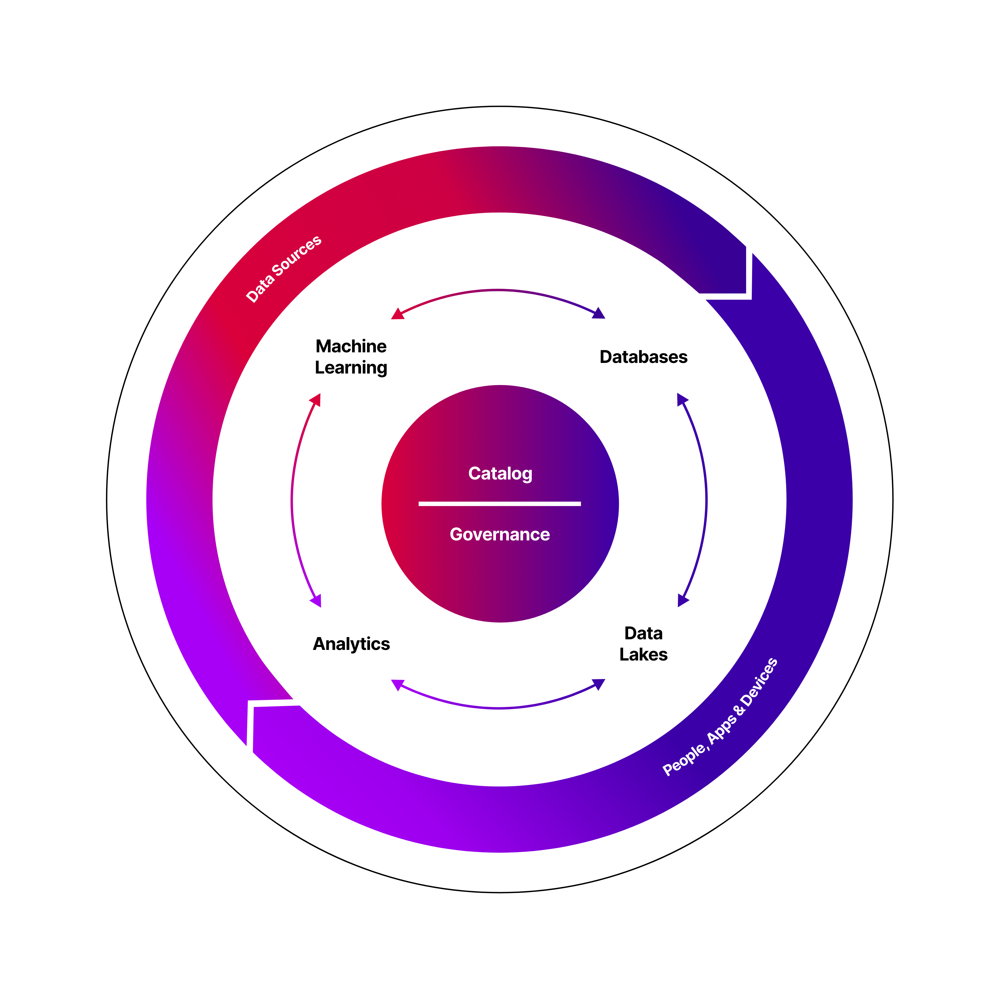
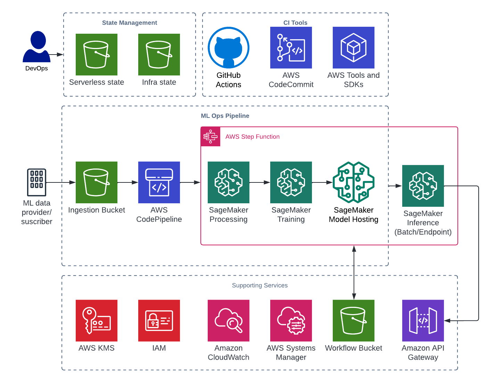

# Firemind MLOps Toolkit Framework

[Report issue](https://github.com/hellofiremind/ml-toolkit/issues/new?assignees=&labels=&template=bug_report.md&title=) . [Submit a feature](https://github.com/hellofiremind/ml-toolkit/issues/new?assignees=&labels=&template=feature_request.md&title=)

<details>
<summary>Table of Contents</summary>
<ol>
<li><a href="#user-content-about-the-project">About The Project</a></li>
<li><a href="#initial-setup">Initial Setup</a></li>
<ol>
<li><a href="#dependencies">Dependencies</a></li>
<li><a href="#prerequisites">Pre-requisites</a></li>
<li><a href="#deploy-iam-role-and-oidc-identity-provider">Deploy IAM Role and OIDC Identity Provider</a></li>
<li><a href="#user-content-github-workflows">GitHub workflows</a></li>
<li><a href="#user-content-infrastructure-setup">Infrastructure Setup</a></li>
<li><a href="#user-content-infrastructure-setup-alternative">Infrastructure Setup (Alternative) - CodePipeline</a></li>
</ol>
<li><a href="#user-content-sample-workflow-execution-details">Sample Workflow Execution Details</a></li>
<li><a href="#user-content-tldr">TL;DR Quick Setup</a></li>
</ol>
</details>
<br />

**TL;DR**: This framework allows you to get started with an <b>ML landing zone</b> on AWS using native services and SageMaker models. The example in this framework uses SageMaker's prebuilt models (Scikit Learn and TensorFlow) with example data from AWS.

#### MLOps Toolkit is part of [Firemind's Modern Data Strategy](https://www.firemind.com/modern-data-strategy/) tools
[](https://www.firemind.com/modern-data-strategy/)

### Key AWS Services

- AWS CodePipeline
- AWS Step Functions
- AWS Identity and Access Management (IAM) Roles
- AWS Key Management Service (AWS KMS)
- Amazon Simple Storage Service (Amazon S3) Buckets
- AWS Systems Manager Parameter Store (SSM) Parameters
- AWS Lambda
- Amazon SageMaker

<!-- ABOUT THE PROJECT -->

## Infrastructure Diagram

[](https://www.firemind.com/modern-data-strategy/)

## Initial Setup

<!-- DEPENDENCIES -->

### Dependencies

Please complete these steps before continuing.

1. Install Python 3.9 (This can be done through the installer <a href="https://www.python.org/downloads/macos/" target="_blank">here</a> (where you should select a stable release for Python 3.9).
1. Install NodeJs with npm (Install instructions in the official repo <a href="https://github.com/nvm-sh/nvm" target="_blank">here</a>.
1. Install Poetry <a href="https://python-poetry.org/docs/" target="_blank">here</a>.

<!-- PREREQUISITES -->

### Prerequisites

Ensure your CLI has correct credentials to access the AWS account you want this framework deployed to.

To use this framework, create an empty remote repo in your organisation in GitHub, clone a copy of this repo and push to your remote.

Navigate to `github-oidc-federation-template-infra.yml` file and add a default value for:

- `GitHubOrg`: This should be the name of the organisation where your repo exists.
- `FullRepoName`: The name of the repo which has a copy of this infrastructure.

Add the following to your remote repository secrets:

- `AWS_REGION`: <e.g. eu-west-1>.
- `S3_TERRAFORM_STATE_REGION`: <e.g. eu-west-1>.
- `S3_TERRAFORM_STATE_BUCKET`: ml-core-<account_id>-state-bucket.
- `ACTION_IAM_ROLE`: arn:aws:iam::<account_id>:role/GithubActionsDeployInfra.

Further details can be found <a href="https://github.com/Azure/actions-workflow-samples/blob/master/assets/create-secrets-for-GitHub-workflows.md" target="_blank"></a>

### Deploy IAM Role and OIDC Identity Provider

The first step is to deploy a GitHub Actions Role and GitHub OIDC identity provider in the account that allows you to run GitHub actions for the infrastructure.

**Note:** This only needs to be run once per AWS account.
Details on this can be found here: https://github.com/marketplace/actions/configure-aws-credentials-action-for-github-actions

- <b>Important Note:</b> If an identity provider already exists for your project. <i>Always check that the identity provider exists for your project, which can be found within the AWS IAM console.</i>

Run the following command in the terminal. Can change the stack name and region:

```
aws cloudformation deploy --template-file github-oidc-federation-template-infra.yml --stack-name app-authorisation-infra-github-authentication --region {{ eu-west-1 }} --capabilities CAPABILITY_IAM --capabilities CAPABILITY_NAMED_IAM
```

<!-- GITHUB WORKFLOWS -->

### GitHub Workflows

GitHub actions is used to deploy the infrastructure.
The config for this can be found in the `.gitHub/workflows`

We send through a variety of different environment variables

- `BUILD_STAGE` - We get this from the branch names.
- `S3_TERRAFORM_STATE_BUCKET` - Get this from GitHub secrets.
- `S3_TERRAFORM_STATE_REGION` - Get this from GitHub secrets.
- `AWS_REGION` - Get this from GitHub secrets.
- `SERVICE` - Has default but can be set by user in the `.github/workflows` files.

<!-- INFRASTRUCTURE SETUP -->

### Infrastructure Setup

For quick setup follow these instructions:

- Create an empty repo within your GitHub account.
- Checkout this repository on development branch to you local drive and push to your remote repo.
- Assuming the GitHub actions have been set up correctly, the deployment will begin.

If you are having any issues please report a bug via the repo.

<!-- INFRASTRUCTURE SETUP ALTERNATIVE -->

### Infrastructure Setup (Alternative) - CodePipeline

If GitHub actions is not the preferred CI/CD of choice then you can deploy using CodePipeline.
<b>Note</b>: After deployment of the framework you should have two pipelines: The first is the CI/CD pipeline and the second being the framework pipeline.

The Terraform resources for this CI/CD can be found in the `cicd` folder. The following resources are deployed:
<ul>
<li>AWS CodePipline</li>
<li>AWS CodeBuild</li>
<li>AWS Identity Access Management (IAM)</li>
<li>AWS Key Management Service (KMS)</li>
<li>Amazon Simple Storage Service (S3)</li>
</ul>

Before deployment you must configure some values to ensure the pipeline is connected correctly to your repository.
<ol>
<li>Firstly in <code>deployment-scripts/cicd-env.sh</code> you must change these values to match your desired Repo and Branch for CI/CD :</li>
<ul>
<li>E.g. <code>TF_VAR_FULL_REPOSITORY_ID="ORG_NAME/REPO_NAME"</code></li>
<li>E.g. <code>TF_VAR_BRANCH="development"</code></li>
<li>Optionally you can also modify TF_VAR_CICD_SERVICE</li>
</ul>
<li>The following variables can be optionally modified but will work if unchanged. In <code>deployment-scripts/quick-deploy.sh</code>: </li>
<ul>
<li>S3_TERRAFORM_STATE_REGION</li>
<li>TF_VAR_SERVICE</li>
<li>TF_VAR_BUILD_STAGE</li>
</ul>
<li>Finally, ensure you have the correct credentials configured in your terminal for deploying into your AWS account.</li>
</ol>

To deploy CI/CD Codepipeline, run the following command:
```
bash deployment-scripts/deploy-codepipeline.sh
```

After deployment, navigate to CodePipeline in your AWS Account and select the `'Settings' > 'Connections'` section in the left navigation bar.</p>
There should be a pending `'github-connection'` which you must update and connect to your GitHub Repo.</p>
<b>Note:</b> Your GitHub User must have permissions to connect the repo to AWS through CodeStar.</p>
Once complete, the framework pipeline is ready to use and any changes you make to this repo will be deployed though CI/CD.

To destroy the framework, run the following commands in order:

```
bash deployment-scripts/quick-destroy.sh
```
```
bash deployment-scripts/destroy-codepipeline.sh
```


<!-- SAMPLE WORKFLOW EXECUTION DETAILS -->

## Sample Workflow Execution Details

The framework is currently setup to work with the following example runbook provided by AWS. More details can be found <a href="https://github.com/aws/amazon-sagemaker-examples/blob/main/sagemaker-pipelines/tabular/train-register-deploy-pipeline-model/train%20register%20and%20deploy%20a%20pipeline%20model.ipynb" target="_blank">here</a>.

<ol>
  <li>Once the infrastructure has been deployed, navigate to CodePipeline and <code>Release Change</code> on the pipeline.</li>
  <li>The first stage will read the <code>manifest.json</code> file with all the configurations needs for the pipeline to run end to end.
  <ul>
    <li>The contents of this file is populated during the next stage but a reference to all the keys can be found in <code>config/manifest.json</code>.</li>
  </ul>
  </li>
  <li>The <code>CreateSchema</code> Lambda Function updates the manifest file with resolved values.
  <ul>
    <li>Details of these values can be found in code/lambda/create_schema under <code>update_payload()</code> function.</li>
  </ul>
  </li>
  <li>A <code>Manual approval</code> stage will prompt the user to upload the source files to the relevant location in S3.
  <ul>
    <li>The location in S3 will be <code>{workflow_bucket}{timestamp_of_execution}/source</code>.</li>
    <li>A sample file has been added in <code>sample-files/cal_housing.csv</code> which can be uploaded to the above location.</li>
  </ul>
  </li>
  <li>After approval, the <code>Machine Learning Step Function</code> is invoked with the contents of the manifest file. During this phase the following occurs:
  <ul>
    <li>Preprocessing of the data (<code>workflow/preprocess.py</code>).</li>
    <li>Training of data (<code>workflow/train.py</code>).</li>
    <li>Model Evaluation (<code>workflow/evaluation.py</code>).</li>
    <li>Model Hosting.</li>
  </ul>
  </li>
  <li>The output for all the steps in the step function can be found in the workflow bucket</li>
  <li>CodePipelines next stage will prompt the user to verify the model. This can be done using the output provided by the evaluation step.</li>
  <li>After verification, the inference stage begins. The <code>UpdateSchema</code> lambda function is invoked and modifies the manifest payload.
  <ul>
    <li>Modifications can be found in <code>code/lambda/update_schema</code> under <code>update_payload()</code> function.</li>
  </ul>
  </li>
  <li>Another prompt in CodePipeline will ask the user to verify that the inference data has been uploaded. 
  <ul>
    <li>The location in S3 will be <code>{workflow_bucket}{timestamp_of_execution}/inference</code></li>
    <li>Sample file for inference can be found at <code>sample-files/cal_pred.csv</code> which can be uploaded to the above location.</li>
    <li>Note: This only needs to be uploaded if the EndpointType is configured to <code>Batch</code> instead of <code>SageMaker Endpoint</code>. This can be configured in the <code>update_schema -> update_payload</code> lambda function code.</li>
  </ul>
  </li>
  <li>Finally, the Machine Learning Step Function is invoked with the new payload.
  <ul>
    <li>Batch Transform Job is invoked.</li>
    <li>Real Time Endpoint.</li>
  </ul>
  </li>
  <li>The output of inference can be found: <code>{workflow_bucket}{timestamp_of_execution}/inference/out</code>.</li>
</ol>

<!-- TLDR -->

## TL;DR

Configure your AWS credentials in the CLI with permissions to deploy to your account.

Deploy

```
bash deployment-scripts/quick-deploy.sh
```

Destroy

```
bash deployment-scripts/quick-destroy.sh
```
